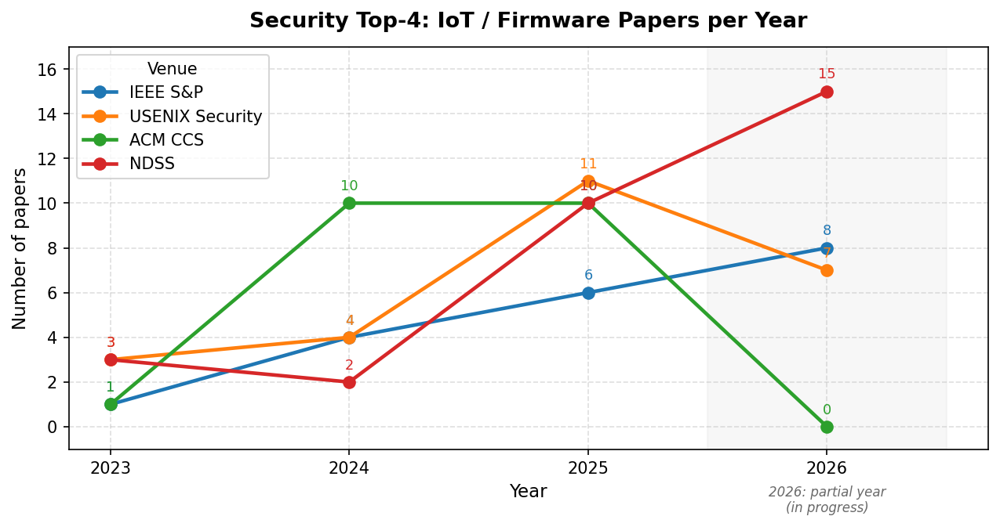
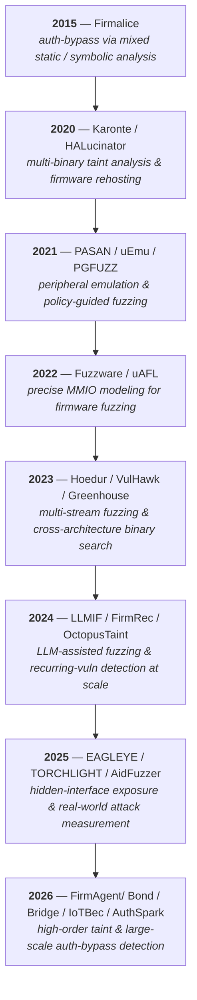

# IoT Security Papers

   

A curated collection of research papers on IoT / embedded firmware security, organized by technique and topic. Built for anyone learning or researching in this area.

## 📊 Overview

**156 papers** indexed (38 more from 2010–2022 not shown in the table below — see each category for the full history).

| Venue | 2023 | 2024 | 2025 | 2026 | Total |
|---|---|---|---|---|---|
| IEEE S&P | 1 | 4 | 6 | 8 | **22** |
| USENIX Security | 3 | 4 | 11 | 7 | **34** |
| CCS | 1 | 10 | 10 | – | **22** |
| NDSS | 3 | 2 | 10 | 15 | **36** |
| AI/SE Top (ISSTA/ASE/ICSE/ICLR/FSE) | 4 | 1 | 8 | – | **15** |
| Other (journal/workshop/thesis/arXiv) | 2 | 4 | 4 | – | **27** |

## 📈 Trend — Security Top-4 (2023–2026)

## 🕰️ Technique Evolution

A rough throughline of how IoT/firmware vulnerability-discovery techniques have shifted, based on the tools in this collection — from peripheral/firmware rehosting, to taint analysis, to LLM-assisted fuzzing, to large-scale automated auth-bypass detection:

## Categories
[01. Static Analysis — Traditional](#01-static-analysis-traditional) 
[02. Static Analysis — LLM-Assisted](#02-static-analysis-llm-assisted)
[03. Dynamic Analysis — Fuzzing](#03-dynamic-analysis-fuzzing) 
[04. Dynamic Analysis — Symbolic Execution & Hybrid](#04-dynamic-analysis-symbolic-execution) 
[05. Surveys & Taxonomies](#05-surveys-and-taxonomies)
[06. Measurement & Large-Scale Studies](#06-measurement-and-large-scale-studies)
[07. Protocol & Application Security](#07-protocol-and-application-security)
[08. Honeypot & Deception](#08-honeypot-and-deception)

## 01. Static Analysis — Traditional

Source-code / binary static analysis, taint tracking, binary similarity and diffing techniques for IoT firmware.

- [Bridge: High-Order Taint Vulnerabilities Detection in Linux-based IoT Firmware](01-static-analysis-traditional/Bridge_IEEE_S%26P.pdf) (Bridge, IEEE S&P 2026)
- [Discovering Blind-Trust Vulnerabilities in PLC Binaries via State Machine Recovery](https://www.ndss-symposium.org/ndss-paper/discovering-blind-trust-vulnerabilities-in-plc-binaries-via-state-machine-recovery/) (NDSS 2026)
- [FirmCross: Detecting Taint-style Vulnerabilities in Modern C-Lua Hybrid Web Services of Linux-based Firmware](https://www.ndss-symposium.org/ndss-paper/firmcross-detecting-taint-style-vulnerabilities-in-modern-c-lua-hybrid-web-services-of-linux-based-firmware/) (FirmCross, NDSS 2026)
- [IoTBec: An Accurate and Efficient Recurring Vulnerability Detection Framework for Black Box IoT devices](01-static-analysis-traditional/IoTBec%20An%20Accurate%20and%20Efficient%20Recurring%20Vulnerability%20Detection%20Framework%20for%20Black%20Box%20IoT%20devices.pdf) (IoTBec, NDSS 2026)
- [A Comprehensive Memory Safety Analysis of Bootloaders](https://www.ndss-symposium.org/ndss-paper/a-comprehensive-memory-safety-analysis-of-bootloaders/) (NDSS 2025)
- [BadAML: Exploiting Legacy Firmware Interfaces to Compromise Confidential Virtual Machines](https://doi.org/10.1145/3719027.3765123) (BadAML, CCS 2025)
- [Be Aware of What You Let Pass: Demystifying URL-based Authentication Bypass Vulnerability in Java Web Applications](01-static-analysis-traditional/uabscan-ccs25.pdf) (UABScan, ACM CCS 2025)
- [FirmPass: Identifying Broken Password Management in Linux-Based IoT Firmware Through Query-Driven Approaches](01-static-analysis-traditional/FirmPass_Identifying_Broken_Password_Management_in_Linux-Based_IoT_Firmware_Through_Query-Driven_Approaches.pdf) (FirmPass, IEEE Internet of Things Journal 2025)
- [From Constraints to Cracks: Constraint Semantic Inconsistencies as Vulnerability Beacons for Embedded Systems](01-static-analysis-traditional/From%20Constraints%20to%20Crack%20Constraint%20Semantic%20Inconsistencies%20as%20Vulnerability%20Beacons%20for%20Embedded%20Systems.pdf) (NUWA, USENIX Security 2025)
- [SpecChecker-Int: An Extensible Concurrency Bugs Detection Tool for Interrupt-driven Embedded Software](https://dl.acm.org/doi/10.1145/3696630.3728592) (SpecChecker-Int, FSE 2025 (Demo))
- [AutoFirm: Automatically Identifying Reused Libraries inside IoT Firmware at Large-Scale](01-static-analysis-traditional/AutoFirm%20Automatically%20Identifying%20Reused%20Libraries%20inside%20IoT%20Firmware%20at%20Large-Scale.pdf) (AutoFirm, arXiv preprint (no confirmed venue) 2024)
- [BaseMirror: Automatic Reverse Engineering of Baseband Commands from Android's Radio Interface Layer](https://doi.org/10.1145/3658644.3690254) (BaseMirror, CCS 2024)
- [BinPRE: Enhancing Field Inference in Binary Analysis Based Protocol Reverse Engineering](https://doi.org/10.1145/3658644.3690299) (BinPRE, CCS 2024)
- [Faster and Better: Detecting Vulnerabilities in Linux-based IoT Firmware with Optimized Reaching Definition Analysis](01-static-analysis-traditional/2024-Faster%20and%20Better%20Detecting%20Vulnerabilities%20in.pdf) (HermeScan, NDSS 2024)
- [FITS: Inferring Intermediate Taint Sources for Effective Vulnerability Analysis of IoT Device Firmware](01-static-analysis-traditional/FITS%20Inferring%20Intermediate%20Taint%20Sources%20for%20Effective%20Vulnerability%20Analysis%20of%20IoT%20Device%20Firmware.pdf) (FITS, ASPLOS 2024)
- [LuaTaint: A Static Analysis System for Web Configuration Interface Vulnerability of Internet of Things Devices](01-static-analysis-traditional/23-LuaTaint%20A%20Static%20Taint%20Analysis%20System%20for%20Web.pdf) (LuaTaint, IEEE Internet of Things Journal 2024)
- [OctopusTaint: Advanced Data Flow Analysis for Detecting Taint-Based Vulnerabilities in IoT/IIoT Firmware](01-static-analysis-traditional/OctopusTaint_Advanced%20Data%20Flow%20Analysis%20for%20Detecting%20taint-based%20vulnerabilities%20in%20iot%20firmware.pdf) (OctopusTaint, ACM CCS 2024)
- [Operation Mango: Scalable Discovery of Taint-Style Vulnerabilities in Binary Firmware Services](01-static-analysis-traditional/2024%20-%20USENIX%20Security%20-%20Mango.pdf) (Mango, USENIX Security 2024)
- [Your Firmware Has Arrived: A Study of Firmware Update Vulnerabilities](01-static-analysis-traditional/sec24-Your%20Firmware%20Has%20Arrived-A%20Study%20of%20Firmware%20Update%20Vulnerabilities.pdf) (ChkUp, USENIX Security 2024)
- [Detecting Vulnerabilities in Linux-Based Embedded Firmware with SSE-Based On-Demand Alias Analysis](01-static-analysis-traditional/23-Detecting%20Vulnerabilities%20in%20Linux-Based%20Embedded%20Firmware%20with%20SSE-Based%20On-Demand%20Alias%20Analysis.pdf) (EmTaint, ISSTA 2023)
- [IoTFlow: Inferring IoT Device Behavior at Scale through Static Mobile Companion App Analysis](01-static-analysis-traditional/ccs2023-iotflow.pdf) (IoTFlow, ACM CCS 2023)
- [VulHawk: Cross-architecture Vulnerability Detection with Entropy-based Binary Code Search](01-static-analysis-traditional/23-VulHawk-Cross-architecture%20Vulnerability%20Detection.pdf) (VulHawk, NDSS 2023)
- [RapidPatch: Firmware Hotpatching for Real-Time Embedded Devices](01-static-analysis-traditional/sec22-RapidPatch%20Firmware%20Hotpatching%20for%20Real-Time%20Embedded%20Devices.pdf) (RapidPatch, USENIX Security 2022)
- [Sharing More and Checking Less: Leveraging Common Input Keywords to Detect Bugs in Embedded Systems](01-static-analysis-traditional/Chen%20et%20al.%20-%20Sharing%20More%20and%20Checking%20Less%20Leveraging%20Common%20Sanitizer%20Checks.pdf) (USENIX Security 2021)
- [HALucinator: Firmware Re-hosting Through Abstraction Layer Emulation](01-static-analysis-traditional/sec20-HALucinator_%20Firmware%20re-hosting%20through%20abstraction%20layer%20emulation.pdf) (HALucinator, USENIX Security 2020)
- [KARONTE: Detecting Insecure Multi-binary Interactions in Embedded Firmware](01-static-analysis-traditional/20-Karonte_Detecting_Insecure_Multi-binary_Interactions_in_Embedded_Firmware.pdf) (Karonte, IEEE S&P 2020)

## 02. Static Analysis — LLM-Assisted

LLM- and AI-driven static analysis, code understanding, and vulnerability reasoning for embedded firmware.

- [An LLM-Driven Fuzzing Framework for Detecting Logic Instruction Bugs in PLCs](https://www.ndss-symposium.org/ndss-paper/an-llm-driven-fuzzing-framework-for-detecting-logic-instruction-bugs-in-plcs/) (NDSS 2026)
- [FirmAgent: Leveraging Fuzzing to Assist LLM Agents with IoT Firmware Vulnerability Discovery](https://www.ndss-symposium.org/ndss-paper/firmagent-leveraging-fuzzing-to-assist-llm-agents-with-iot-firmware-vulnerability-discovery/) (FirmAgent, NDSS 2026)
- [PANGOLIN: Fuzzing Multilingual IoT Firmware with LLM-Driven Code Analysis](https://www.usenix.org/conference/usenixsecurity26/presentation/jia-zhipeng) (PANGOLIN, USENIX Security 2026)
- [ProtocolGuard: Detecting Protocol Non-compliance Bugs via LLM-guided Static Analysis and Dynamic Verification](https://www.ndss-symposium.org/ndss-paper/protocolguard-detecting-protocol-non-compliance-bugs-via-llm-guided-static-analysis-and-dynamic-verification/) (ProtocolGuard, NDSS 2026)
- [EAGLEYE: Exposing Hidden Web Interfaces in IoT Devices via Routing Analysis](02-static-analysis-llm-assisted/EAGLEYE%20Exposing%20Hidden%20Web%20Interfaces%20in%20IoT%20Devices%20via%20Routing%20Analysis.pdf) (EAGLEYE, NDSS 2025)
- [Large Language Model-driven Security Assistant for Internet of Things via Chain-of-Thought](02-static-analysis-llm-assisted/Large%20Language%20Model-driven%20Security%20Assistant%20for%20Internet%20of%20Things%20via%20CoT.pdf) (ICoT, IEEE Internet of Things Journal 2025)
- [Large Language Model-Powered Protected Interface Evasion: Automated Discovery of Broken Access Control Vulnerabilities in Internet of Things Devices](02-static-analysis-llm-assisted/ACBreaker.pdf) (ACBreaker, Sensors (MDPI journal) 2025)
- [Moye: A Wallbreaker for Monolithic Firmware](https://dl.acm.org/doi/10.1109/ICSE55347.2025.00053) (Moye, ICSE 2025)
- [Nova: Generative Language Models for Assembly Code with Hierarchical Attention and Contrastive Learning](https://arxiv.org/abs/2311.13721) (Nova, ICLR 2025)
- [Fuzzing BusyBox: Leveraging LLM and Crash Reuse for Embedded Bug Unearthing](02-static-analysis-llm-assisted/Fuzzing%20BusyBox%20Leveraging%20LLM%20and%20Crash%20Reuse%20for%20Embedded%20Bug%20unearth.pdf) (USENIX Security 2024)
- [LLMIF: Augmented Large Language Model for Fuzzing IoT Devices](02-static-analysis-llm-assisted/LLMIF%20Augmented%20Large%20Language%20Model%20for%20Fuzzing%20IoT%20Devices.pdf) (LLMIF, IEEE S&P 2024)

## 03. Dynamic Analysis — Fuzzing

Firmware/protocol fuzzing, rehosting-based fuzzing, greybox/blackbox fuzzers for embedded and IoT targets.

- [ADGFUZZ: Assignment Dependency-Guided Fuzzing for Robotic Vehicles](https://www.ndss-symposium.org/ndss-paper/adgfuzz-assignment-dependency-guided-fuzzing-for-robotic-vehicles/) (ADGFUZZ, NDSS 2026)
- [Bond (exact official title unconfirmed)](03-dynamic-analysis-fuzzing/Bond_USENIX_Security.pdf) (Bond, USENIX Security 2026)
- [BSFuzzer: Context-Aware Semantic Fuzzing for BLE Logic Flaw Detection](https://www.ndss-symposium.org/ndss-paper/bsfuzzer-context-aware-semantic-fuzzing-for-ble-logic-flaw-detection/) (BSFuzzer, NDSS 2026)
- [Camveil: Unveiling Security Camera Vulnerabilities through Multi-Protocol Coordinated Fuzzing](https://sp2026.ieee-security.org/accepted-papers.html) (Camveil, IEEE S&P 2026)
- [FirmReBugger: A Benchmark Framework for Monolithic Firmware Fuzzers](https://www.usenix.org/conference/usenixsecurity26/presentation/duong) (FirmReBugger, USENIX Security 2026)
- [Fuzzing the Physical Space: Physics-Aware Testing of Black-Box Industrial Control Systems](https://sp2026.ieee-security.org/accepted-papers.html) (Fuzzing the Physical Space, IEEE S&P 2026)
- [PhyFuzz: Detecting Sensor Vulnerabilities with Physical Signal Fuzzing](https://www.ndss-symposium.org/ndss-paper/phyfuzz-detecting-sensor-vulnerabilities-with-physical-signal-fuzzing/) (PhyFuzz, NDSS 2026)
- [RTCON: Context-Adaptive Function-Level Fuzzing for RTOS Kernels](https://www.ndss-symposium.org/ndss-paper/rtcon-context-adaptive-function-level-fuzzing-for-rtos-kernels/) (RTCON, NDSS 2026)
- [SmuFuzz: Enable Deep System Management Mode Fuzzing in Fully Featured UEFI Runtime Environment](https://sp2026.ieee-security.org/accepted-papers.html) (SmuFuzz, IEEE S&P 2026)
- [Stop Starving or Stuffing Me: Boosting Firmware Fuzzing Efficiency with On-demand Input Delivery](https://arxiv.org/pdf/2605.16798) (IEEE S&P 2026)
- [Through the Authentication Maze: Detecting Authentication Bypass Vulnerabilities in Firmware Binaries](03-dynamic-analysis-fuzzing/Through%20the%20Authentication%20Maze%20Detecting%20Authentication%20Bypass%20Vulnerabilities%20in%20Firmware%20Binaries.pdf) (AuthSpark, NDSS 2026)
- [AidFuzzer: Adaptive Interrupt-Driven Firmware Fuzzing via Run-Time State Recognition](03-dynamic-analysis-fuzzing/AidFuzzer%20Adaptive%20Interrupt-Driven%20Firmware%20Fuzzing%20via%20Run-Time%20State%20Recognition.pdf) (AidFuzzer, USENIX Security 2025)
- [BaseBridge: Bridging the Gap Between Over-the-Air and Emulation Testing for Cellular Baseband Firmware](https://ieeexplore.ieee.org/document/11023426/) (BaseBridge, IEEE S&P 2025)
- [BLuEMan: A Stateful Simulation-based Fuzzing Framework for Open-Source RTOS BLE Protocol Stacks](https://www.usenix.org/conference/usenixsecurity25/presentation/kao) (BLuEMan, USENIX Security 2025)
- [ConTest: Taming the Cyber-physical Input Space in Fuzz Testing with Control Theory](https://doi.org/10.1145/3719027.3765129) (ConTest, CCS 2025)
- [DRIFT: Debug-based Trace Inference for Firmware Testing](https://ieeexplore.ieee.org/document/11334624) (DRIFT, ASE 2025)
- [FirmRCA: Towards Post-Fuzzing Analysis on ARM Embedded Firmware with Efficient Event-based Fault Localization](https://arxiv.org/abs/2410.18483) (FirmRCA, IEEE S&P 2025)
- [FUZZUER: Enabling Fuzzing of UEFI Interfaces on EDK-2](https://www.ndss-symposium.org/ndss-paper/fuzzuer-enabling-fuzzing-of-uefi-interfaces-on-edk-2/) (FUZZUER, NDSS 2025)
- [HouseFuzz: Service-Aware Grey-Box Fuzzing for Vulnerability Detection in Linux-Based Firmware](03-dynamic-analysis-fuzzing/HouseFuzz%20Service-Aware%20Grey-Box%20Fuzzing%20for%20Vulnerability%20Detection%20in%20Linux-Based%20Firmware.pdf) (HouseFuzz, IEEE S&P 2025)
- [ICSQuartz: Scan Cycle-Aware and Vendor-Agnostic Fuzzing for Industrial Control Systems](https://www.ndss-symposium.org/ndss-paper/icsquartz-scan-cycle-aware-and-vendor-agnostic-fuzzing-for-industrial-control-systems/) (ICSQuartz, NDSS 2025)
- [LEMIX: Enabling Testing of Embedded Applications as Linux Applications](https://www.usenix.org/conference/usenixsecurity25/presentation/tanksalkar) (LEMIX, USENIX Security 2025)
- [LLFuzz: An Over-the-Air Dynamic Testing Framework for Cellular Baseband Lower Layers](https://www.usenix.org/conference/usenixsecurity25/presentation/hoang) (LLFuzz, USENIX Security 2025)
- [MBFuzzer: A Multi-Party Protocol Fuzzer for MQTT Brokers](https://www.usenix.org/conference/usenixsecurity25/presentation/song-xiangpu) (MBFuzzer, USENIX Security 2025)
- [SAECRED: A State-Aware, Over-the-Air Protocol Testing Approach for SAE Handshake Implementations of COTS Wi-Fi Access Points](https://ieeexplore.ieee.org/document/11023492/) (SAECRED, IEEE S&P 2025)
- [Stateful Analysis and Fuzzing of Commercial Baseband Firmware (Loris)](https://ieeexplore.ieee.org/document/11023430/) (IEEE S&P 2025)
- [Structure-Aware, Diagnosis-Guided ECU Firmware Fuzzing (EcuFuzz)](https://dl.acm.org/doi/10.1145/3728914) (ISSTA 2025)
- [Collapse Like A House of Cards: Hacking Building Automation System Through Fuzzing](https://doi.org/10.1145/3658644.3690216) (CCS 2024)
- [Labrador: Response Guided Directed Fuzzing for Black-box IoT Devices](03-dynamic-analysis-fuzzing/24-LABRADOR%20Response%20Guided%20Directed%20Fuzzing%20for%20Black-box%20IoT%20Devices.pdf) (Labrador, IEEE S&P 2024)
- [RANsacked: A Domain-Informed Approach for Fuzzing LTE and 5G RAN-Core Interfaces](https://doi.org/10.1145/3658644.3670320) (RANsacked, CCS 2024)
- [RIoTFuzzer: Companion App Assisted Remote Fuzzing for Detecting Vulnerabilities in IoT Devices](https://doi.org/10.1145/3658644.3670342) (RIoTFuzzer, CCS 2024)
- [SyzTrust: State-aware Fuzzing on Trusted OS Designed for IoT Devices](03-dynamic-analysis-fuzzing/24-SyzTrust-State-aware%20Fuzzing%20on%20Trusted%20OS%20Designed%20for%20IoT%20Devices.pdf) (SyzTrust, IEEE S&P 2024)
- [A Case Study on Fuzzing Satellite Firmware](03-dynamic-analysis-fuzzing/23-A%20Case%20Study%20on%20Fuzzing%20Satellite%20Firmware.pdf) (NDSS SpaceSec Workshop 2023)
- [Forming Faster Firmware Fuzzers](03-dynamic-analysis-fuzzing/sec23_Forming%20Faster%20Firmware%20Fuzzers.pdf) (SAFIREFUZZ, USENIX Security 2023)
- [Fuzzing Embedded Systems using Debug Interfaces](03-dynamic-analysis-fuzzing/23-Fuzzing%20Embedded%20Systems%20using%20Debug%20Interfaces.pdf) (GDBFuzz, ISSTA 2023)
- [Greenhouse: Single-Service Rehosting of Linux-Based Firmware Binaries in User-Space Emulation](03-dynamic-analysis-fuzzing/23-greenhouse%20appendix-tay.pdf) (Greenhouse, USENIX Security 2023)
- [Hoedur: Embedded Firmware Fuzzing using Multi-Stream Inputs](03-dynamic-analysis-fuzzing/23-Hoedur%20Embedded%20Firmware%20Fuzzing.pdf) (Hoedur, USENIX Security 2023)
- [SplITS: Split Input-to-State Mapping for Effective Firmware Fuzzing](03-dynamic-analysis-fuzzing/23-Split%20Input-to-State%20Mapping%20for%20Effective%20Firmware%20Fuzzing.pdf) (SplITS, ESORICS 2023)
- [CGFuzzer: A Fuzzing Approach Based on Coverage-Guided Generative Adversarial Networks for Industrial IoT Protocols](03-dynamic-analysis-fuzzing/22CGFuzzer__A_Fuzzing_Approach_Based_on_Coverage_Guided_Generative_Adversarial_Networks_for_Industrial_IoT_Protocols.pdf) (CGFuzzer, IEEE Internet of Things Journal 2022)
- [FirmWire: Transparent Dynamic Analysis for Cellular Baseband Firmware](03-dynamic-analysis-fuzzing/22-ransparent%20dynamic%20analysis%20for%20cellular%20baseband%20firmware.pdf) (FirmWire, NDSS 2022)
- [Fuzzware: Using Precise MMIO Modeling for Effective Firmware Fuzzing](03-dynamic-analysis-fuzzing/sec22-fuzzware.pdf) (Fuzzware, USENIX Security 2022)
- [Fw-fuzz: A Code Coverage-Guided Fuzzing Framework for Network Protocols on Firmware](03-dynamic-analysis-fuzzing/22-Fw_fuzz__A_code_coverage_guided_fuzzing_framework_for_network_protocols_on_firmware.pdf) (Fw-fuzz, Concurrency and Computation: Practice and Experience 2022)
- [uAFL: Non-intrusive Feedback-driven Fuzzing for Microcontroller Firmware](03-dynamic-analysis-fuzzing/22-Non-intrusive%20Feedback-driven%20Fuzzing%20for%20Microcontroller%20Firmware.pdf) (uAFL, ICSE 2022)
- [Automatic Firmware Emulation through Invalidity-guided Knowledge Inference](03-dynamic-analysis-fuzzing/sec21-uEmu.pdf) (uEmu, USENIX Security 2021)
- [DIANE: Identifying Fuzzing Triggers in Apps to Generate Under-constrained Inputs for IoT Devices](03-dynamic-analysis-fuzzing/21-Diane.pdf) (DIANE, IEEE S&P 2021)
- [ESRFuzzer: An Enhanced Fuzzing Framework for Physical SOHO Router Devices to Discover Multi-type Vulnerabilities](03-dynamic-analysis-fuzzing/21ESRFuzzer-%20An%20enhanced%20fuzzing%20framework%20for%20physical%20SOHO%20router%20devices%20to%20discover%20multi-type%20vulnerabilities.pdf) (ESRFuzzer, Cybersecurity (Springer) 2021)
- [FIRM-COV: High-Coverage Greybox Fuzzing for IoT Firmware via Optimized Process Emulation](03-dynamic-analysis-fuzzing/21-FIRM-COV_High-Coverage_Greybox_Fuzzing_for_IoT_Firmware_via_Optimized_Process_Emulation.pdf) (FIRM-COV, IEEE Access 2021)
- [From Library Portability to Para-rehosting: Natively Executing Microcontroller Software on Commodity Hardware](03-dynamic-analysis-fuzzing/21-From%20library%20portability%20to%20para-rehosting-%20Natively%20executing%20open-source%20microcontroller%20oss%20on%20commodity%20hardware.pdf) (NDSS 2021)
- [IFIZZ: Deep-State and Efficient Fault-Scenario Generation to Test IoT Firmware](03-dynamic-analysis-fuzzing/21-IFIZZ_Deep-State_and_Efficient_Fault-Scenario_Generation_to_Test_IoT_Firmware.pdf) (IFIZZ, ASE 2021)
- [PASAN: Detecting Peripheral Access Concurrency Bugs within Bare-Metal Embedded Applications](03-dynamic-analysis-fuzzing/21-PASAN-%20Detecting%20peripheral%20access%20concurrency%20bugs%20within%20Bare-Metal%20embedded%20applications.pdf) (PASAN, USENIX Security 2021)
- [PGFUZZ: Policy-Guided Fuzzing for Robotic Vehicles](03-dynamic-analysis-fuzzing/21-PGFUZZ-%20Policyguided%20fuzzing%20for%20robotic%20vehicles.%20In%20Network%20and%20Distributed%20System%20Security%20Symposium..pdf) (PGFUZZ, NDSS 2021)
- [SIoTFuzzer: Fuzzing Web Interface in IoT Firmware via Stateful Message Generation](03-dynamic-analysis-fuzzing/SIoTFuzzer%20Fuzzing%20Web%20Interface%20in%20IoT%20Firmware%20via%20Stateful%20Message%20Generation.pdf) (SIoTFuzzer, Applied Sciences (MDPI journal) 2021)
- [EM-Fuzz: Augmented Firmware Fuzzing via Memory Checking](03-dynamic-analysis-fuzzing/EM-fuzz.pdf) (EM-Fuzz, IEEE TCAD (journal) 2020)
- [FIRMCORN: Vulnerability-Oriented Fuzzing of IoT Firmware via Optimized Virtual Execution](03-dynamic-analysis-fuzzing/20-FIRMCORN_Vulnerability-Oriented_Fuzzing_of_IoT_Firmware_via_Optimized_Virtual_Execution.pdf) (FIRMCORN, IEEE Access 2020)
- [Frankenstein: Advanced Wireless Fuzzing to Exploit New Bluetooth Escalation Targets](03-dynamic-analysis-fuzzing/sec20-FrankensteinAdvanced%20Wireless%20Fuzzing%20to%20Exploit%20New%20Bluetooth%20Escalation%20Targets.pdf) (Frankenstein, USENIX Security 2020)
- [An Efficient Greybox Fuzzing Scheme for Linux-based IoT Programs Through Binary Static Analysis](03-dynamic-analysis-fuzzing/19-An%20efficient%20greybox%20fuzzing%20scheme%20for%20linux-based%20IoT%20programs%20through%20binary%20static%20analysis..pdf) (IEEE IPCCC 2019)
- [PeriScope: An Effective Probing and Fuzzing Framework for the Hardware-OS Boundary](03-dynamic-analysis-fuzzing/19_NDSS_PeriScope.pdf) (PeriScope, NDSS 2019)
- [Poster: Fuzzing IoT Firmware via Multi-stage Message Generation](03-dynamic-analysis-fuzzing/19-Fuzzing%20IoT%20Firmware%20via%20Multi-stage%20Message%20Generation.pdf) (IoTHunter, ACM CCS (poster) 2019)
- [SRFuzzer: An Automatic Fuzzing Framework for Physical SOHO Router Devices to Discover Multi-type Vulnerabilities](03-dynamic-analysis-fuzzing/19-SRFuzzer-%20An%20automatic%20fuzzing%20framework%20for%20physical%20SOHO%20router%20devices%20to%20discover%20multi-type%20vulnerabilities%2C.pdf) (SRFuzzer, ACSAC 2019)
- [What You Corrupt Is Not What You Crash: Challenges in Fuzzing Embedded Devices](03-dynamic-analysis-fuzzing/18-What%20you%20corrupt%20is%20not%20what%20you%20crash-%20Challenges%20in%20fuzzing%20embedded%20devices.pdf) (NDSS 2018)
- [Automated Dynamic Firmware Analysis at Scale: A Case Study on Embedded Web Interfaces](03-dynamic-analysis-fuzzing/15-Automated%20dynamic%20firmware%20analysis%20at%20scale-%20A%20case%20study%20on%20embedded%20web%20interfaces.pdf) (ACM ASIACCS 2016)
- [A Large-Scale Analysis of the Security of Embedded Firmwares](03-dynamic-analysis-fuzzing/14-large-scale%20analysis%20of%20the%20security%20of%20embedded%20firmwares.pdf) (USENIX Security 2014)
- [RPFuzzer: A Framework for Discovering Router Protocols Vulnerabilities Based on Fuzzing](03-dynamic-analysis-fuzzing/13-RPFuzzer-%20A%20Framework%20for%20Discovering%20Router%20Protocols%20Vulnerabilities%20Based%20on%20Fuzzing.pdf) (RPFuzzer, KSII Trans. on Internet and Information Systems 2013)
- [Experimental Security Analysis of a Modern Automobile](03-dynamic-analysis-fuzzing/10-Experimental%20security%20analysis%20of%20a%20modern%20automobile.pdf) (IEEE S&P 2010)

## 04. Dynamic Analysis — Symbolic Execution & Hybrid

Symbolic/concolic execution and hybrid static+dynamic techniques for firmware vulnerability discovery.

- [Khost: KVM-based Near Native MCU Firmware Rehosting](https://www.usenix.org/conference/usenixsecurity26/presentation/wang-chunlin) (Khost, USENIX Security 2026)
- [User-Space Dependency-Aware Rehosting for Linux-Based Firmware Binaries](https://www.ndss-symposium.org/ndss-paper/user-space-dependency-aware-rehosting-for-linux-based-firmware-binaries/) (NDSS 2026)
- [FlexEmu: Towards Flexible MCU Peripheral Emulation](https://doi.org/10.1145/3719027.3765086) (FlexEmu, CCS 2025)
- [GDMA: Fully Automated DMA Rehosting via Iterative Type Overlays](https://www.usenix.org/conference/usenixsecurity25/presentation/scharnowski) (GDMA, USENIX Security 2025)
- [ICEPRE: ICS Protocol Reverse Engineering via Data-Driven Concolic Execution](https://dl.acm.org/doi/10.1145/3728982) (ICEPRE, ISSTA 2025)
- [Protocol-Aware Firmware Rehosting for Effective Fuzzing of Embedded Network Stacks](https://arxiv.org/pdf/2509.13740) (CCS 2025)
- [Truman: Constructing Device Behavior Models from OS Drivers to Fuzz Virtual Devices](https://www.ndss-symposium.org/ndss-paper/truman-constructing-device-behavior-models-from-os-drivers-to-fuzz-virtual-devices/) (Truman, NDSS 2025)
- [Accurate and Efficient Recurring Vulnerability Detection for IoT Firmware](04-dynamic-analysis-symbolic-execution/24-FirmRec-Accurate%20and%20Efficient%20Recurring%20Vulnerability%20Detection%20for%20IoT%20Firmware.pdf) (FirmRec, ACM CCS 2024)
- [Combining Static Analysis and Dynamic Symbolic Execution in a Toolchain to Detect Fault Injection Vulnerabilities](04-dynamic-analysis-symbolic-execution/Combining%20static%20analysis%20and%20dynamic%20symbolic%20execution%20in%20a%20toolchain%20to%20detect%20fault%20injection%20vulnerabilities.pdf) (Journal of Cryptographic Engineering 2024)
- [FFXE: Dynamic Control Flow Graph Recovery for Embedded Firmware Binaries](04-dynamic-analysis-symbolic-execution/Tsang%20-%20FFXE%20Dynamic%20Control%20Flow%20Graph%20Recovery%20for%20Embe.pdf) (FFXE, USENIX Security 2024)
- [Poster: Discovering Authentication Bypass Vulnerabilities in IoT Devices through Guided Concolic Execution](04-dynamic-analysis-symbolic-execution/Poster%20Discovering%20Authentication%20Bypass.pdf) (NDSS (poster) 2024)
- [MMIO Access-Based Coverage for Firmware Analysis](04-dynamic-analysis-symbolic-execution/23-MMIO_Access-Based_Coverage_for_Firmware_Analysis.pdf) (FIRMSTAT, IEEE CNS 2023)
- [RSFuzzer: Discovering Deep SMI Handler Vulnerabilities in UEFI Firmware with Hybrid Fuzzing](04-dynamic-analysis-symbolic-execution/RSFuzzer_Discovering_Deep_SMI_Handler_Vulnerabilities_in_UEFI_Firmware_with_Hybrid_Fuzzing.pdf) (RSFuzzer, IEEE S&P 2023)
- [Westworld: Fuzzing-Assisted Remote Dynamic Symbolic Execution of Smart Apps on IoT Cloud Platforms](04-dynamic-analysis-symbolic-execution/21-Westworld%20-%20Fuzzing-Assisted%20Remote%20Dynamic%20Symbolic.pdf) (Westworld, ACSAC 2021)
- [Device-agnostic Firmware Execution is Possible: A Concolic Execution Approach for Peripheral Emulation](04-dynamic-analysis-symbolic-execution/20-Laelaps.pdf) (Laelaps, ACSAC 2020)
- [Firmalice: Automatic Detection of Authentication Bypass Vulnerabilities in Binary Firmware](04-dynamic-analysis-symbolic-execution/Firmalice%20-%20Automatic%20Detection%20of%20Authentication%20Bypass%20Vulnerabilities%20in%20Binary%20Firmware.pdf) (Firmalice, NDSS 2015)

## 05. Surveys & Taxonomies

Survey papers, SoKs, and taxonomies covering IoT/firmware security research.

- ["We just did not have that on the embedded system": Insights and Challenges from Embedded CTF Competitions](https://doi.org/10.1145/3719027.3765039) (CCS 2025)
- [Mens Sana In Corpore Sano: Sound Firmware Corpora for Vulnerability Research](05-surveys-and-taxonomies/Mens%20Sana%20In%20Corpore%20Sano%20Sound%20Firmware%20Corpora%20for%20Vulnerability%20Research.pdf) (LFwC, NDSS 2025)
- [On the Contents and Utility of IoT Cybersecurity Guidelines](05-surveys-and-taxonomies/On%20the%20Contents%20and%20Utility%20of%20IoT%20Cybersecurity%20Guidelines.pdf) (Proc. ACM on Software Engineering (FSE) 2024)
- [Rust for Embedded Systems: Current State and Open Problems](https://doi.org/10.1145/3658644.3690275) (Rust for Embedded Systems, CCS 2024)
- [Staving off the IoT Armageddon](https://doi.org/10.1145/3658644.3690379) (CCS 2024)
- [A Taxonomy of IoT Firmware Security and Principal Firmware Analysis Techniques](05-surveys-and-taxonomies/A_taxonomy_of_IoT_firmware_security_and_principal_firmware_analysis_techniques.pdf) (Intl. J. Critical Infrastructure Protection 2022)
- [Embedded Fuzzing: A Review of Challenges, Tools, and Solutions](05-surveys-and-taxonomies/22-Embedded_fuzzing__a_review_of_challenges__tools__and_solutions.pdf) (Cybersecurity (Springer) 2022)
- [Firmware Fuzzing: The State of the Art](05-surveys-and-taxonomies/Firmware%20Fuzzing-The%20State%20of%20the%20Art.pdf) (Internetware 2021)
- [Dynamic Binary Firmware Analysis: Challenges & Solutions](05-surveys-and-taxonomies/19-Dynamic%20binary%20firmware%20analysis-challenges%20%26%20solutions.pdf) (PhD Thesis, EURECOM 2019)

## 06. Measurement & Large-Scale Studies

Internet-wide measurement, exposure analysis, and empirical/industry studies of IoT security in the wild.

- [Missing, Present and Conflicting: A Large Scale Analysis of IoT Update Information in the EU Market](https://www.usenix.org/conference/usenixsecurity26/presentation/vetrivel) (Missing, Present and Conflicting, USENIX Security 2026)
- [Privacy Perspectives and Practices of Chinese Smart Home Product Teams](https://arxiv.org/abs/2506.06591) (IEEE S&P 2026)
- [Responsible Disclosure is a Two-Way Street: Empirically Measuring the Responsible Disclosure Contract in the Firmware Ecosystem](https://sp2026.ieee-security.org/accepted-papers.html) (IEEE S&P 2026)
- ["We Can't Change It Overnight": Understanding Industry Perspectives on IoT Product Security Compliance and Certification](06-measurement-and-large-scale-studies/We_cant_Change_it_Overnight_Understanding_Industry_Perspectives_on_IoT_Product_Security_Compliance_and_Certification.pdf) (IEEE S&P 2025)
- [A Large-Scale Study of IoT Security Weaknesses and Vulnerabilities in the Wild](06-measurement-and-large-scale-studies/A%20Large-Scale%20Study%20of%20IoT%20Security%20Weaknesses%20and%20vulnerabilities%20in%20the%20Wild.pdf) (ACM TOSEM 2025)
- [Am I Infected? Lessons from Operating a Large-Scale IoT Security Diagnostic Service](06-measurement-and-large-scale-studies/Am%20I%20Infected.%20Lessons%20from%20Operating%20a%20Large-Scale%20IoT%20Security%20Diagnostic%20Service.pdf) (USENIX Security 2025)
- [Analysis of Misconfigured IoT MQTT Deployments and a Lightweight Exposure Detection System](06-measurement-and-large-scale-studies/AnalysisofMisconfiguredIoTMQTTDeploymentsandaLightweightExposureDetectionSystem.pdf) (NDSS Workshop (SDIoTSec) 2025)
- [Evaluating Machine Learning-Based IoT Device Identification Models for Security Applications](https://www.ndss-symposium.org/ndss-paper/evaluating-machine-learning-based-iot-device-identification-models-for-security-applications/) (NDSS 2025)
- [Finding 709 Defects in 258 Projects: An Experience Report on Applying CodeQL to Open-Source Embedded Software](https://arxiv.org/abs/2310.00205) (ISSTA 2025)
- [Virtual Reality, Real Problems: A Longitudinal Security Analysis of VR Firmware](https://doi.org/10.1145/3719027.3765102) (Virtual Reality, Real Problems, CCS 2025)
- [Who Left the Door Open? Investigating the Causes of Exposed IoT Devices in an Academic Network](06-measurement-and-large-scale-studies/24-Who%20Left%20the%20Door%20Open-%20Investigating%20the%20Causes%20of%20Exposed%20IoT%20Devices%20in%20an%20Academic%20Network.pdf) (IEEE S&P 2024)
- [An Empirical Study on Concurrency Bugs in Interrupt-Driven Embedded Software](https://dl.acm.org/doi/10.1145/3597926.3598140) (ISSTA 2023)

## 07. Protocol & Application Security

Security of specific IoT protocols, applications, and access-control/authentication models.

- [BLERP: BLE Re-Pairing Attacks and Defenses](https://www.ndss-symposium.org/ndss-paper/blerp-ble-re-pairing-attacks-and-defenses/) (BLERP, NDSS 2026)
- [One Tap to Hijack Them All: A Security Analysis of the Google Fast Pair Protocol](https://sayon.me/papers/whisperpair.pdf) (IEEE S&P 2026)
- [PrivacyShield: Relaying BLE Beacons to Counter Unsolicited Tracking](https://www.usenix.org/conference/usenixsecurity26/presentation/hofhammer) (PrivacyShield, USENIX Security 2026)
- [Security and Privacy Analysis of Tile's Location Tracking Protocol](https://www.usenix.org/conference/usenixsecurity26/presentation/kumar-akshaya) (USENIX Security 2026)
- [WCDCAnalyzer: Scalable Security Analysis of Wi-Fi Certified Device Connectivity Protocols](https://www.ndss-symposium.org/ndss-paper/wcdcanalyzer-scalable-security-analysis-of-wi-fi-certified-device-connectivity-protocols/) (WCDCAnalyzer, NDSS 2026)
- [A Thorough Security Analysis of BLE Proximity Tracking Protocols](https://www.usenix.org/conference/usenixsecurity25/presentation/liu-xiaofeng) (USENIX Security 2025)
- [Discovering and Exploiting IoT Device Hidden Attributes: A New Vulnerability in Smart Homes](https://doi.org/10.1145/3719027.3744847) (CCS 2025)
- [Hidden and Lost Control: on Security Design Risks in IoT User-Facing Matter Controller](https://www.ndss-symposium.org/ndss-paper/hidden-and-lost-control-on-security-design-risks-in-iot-user-facing-matter-controller/) (Hidden and Lost Control, NDSS 2025)
- [IMUFUZZER: Resilience-based Discovery of Signal Injection Attacks on Robotic Aerial Vehicles](https://ieeexplore.ieee.org/document/11334621) (IMUFUZZER, ASE 2025)
- [TORCHLIGHT: Shedding LIGHT on Real-World Attacks on Cloudless IoT Devices Concealed within the Tor Network](07-protocol-and-application-security/TORCHLIGHT%20Shedding%20LIGHT%20on%20Real-World%20Attacks%20on%20Cloudless%20IoT%20Devices%20Concealed%20within%20the%20Tor%20Network.pdf) (TORCHLIGHT, USENIX Security 2025)
- [ZVDetector: State-Guided Vulnerability Detection System for Zigbee Devices](https://doi.org/10.1145/3719027.3765035) (ZVDetector, CCS 2025)
- [BlueSWAT: A Lightweight State-Aware Security Framework for Bluetooth Low Energy](https://doi.org/10.1145/3658644.3670397) (BlueSWAT, CCS 2024)
- [Drone Security and the Mysterious Case of DJI's DroneID](07-protocol-and-application-security/ndss2023_Drone%20Security%20and%20the%20Mysterious%20Case%20of%20DJI%27s%20DroneID.pdf) (NDSS 2023)
- [Systematically Detecting Packet Validation Vulnerabilities in Embedded Network Stacks](https://arxiv.org/abs/2308.10965) (ASE 2023)
- [Rethinking Access Control and Authentication for the Home Internet of Things (IoT)](07-protocol-and-application-security/Rethinking%20Access%20Control%20and%20Authentication%20home%20iot.pdf) (USENIX Security 2018)

## 08. Honeypot & Deception

Honeypots, deception techniques, and datasets for observing real-world IoT attacks.

- [HoneySat: A Network-based Satellite Honeypot Framework](https://www.ndss-symposium.org/ndss-paper/honeysat-a-network-based-satellite-honeypot-framework/) (HoneySat, NDSS 2026)
- [Cyber-Physical Deception Through Coordinated IoT Honeypots](08-honeypot-and-deception/Cyber-Physical%20Deception%20Through%20Coordinated%20IoT%20Honeypots.pdf) (CPDS, USENIX Security 2025)
- [DarkWrt: Towards Building a Dataset of Potentially Unwanted Functions in IoT Devices](08-honeypot-and-deception/2025-poster-DarkWrt%20Towards%20Building%20a%20Dataset%20of%20Potentially%20Unwanted%20Functions%20in%20IoT%20Devices.pdf) (DarkWrt, NDSS (poster) 2025)
- [Poster: Agentic Shell Honeypot Using Structured Logging](https://doi.org/10.1145/3719027.3760731) (CCS 2025 (poster))
